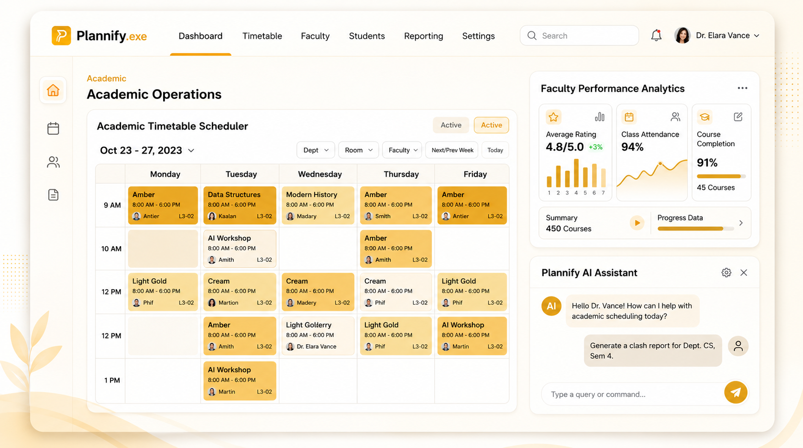

<div align="center">

# 🎓 Plannify.exe
### Next-Generation Academic Operations Platform & Mathematical Scheduling OS

**Empowering universities, colleges, and educational institutions with Google OR-Tools CP-SAT constraint optimization, full-scale Faculty Management (FMS), and Make.com automation**

[](https://fastapi.tiangolo.com/)
[](https://reactjs.org/)
[](https://developers.google.com/optimization)
[](https://tailwindcss.com/)
[](https://supabase.com/)
[](https://make.com/)
[](https://groq.com/)

<br />



</div>

---

## 🌟 Executive Overview

**Plannify.exe** is an enterprise-grade academic operating system built to eliminate manual timetable conflicts and streamline institution-wide faculty workflows. By fusing **Google OR-Tools CP-SAT constraint satisfaction algorithms** with a real-time **Faculty Management System (FMS)**, Plannify transforms institutional logistics into an automated, mathematically verified pipeline.

> [!NOTE]
> For complete technical blueprints, relational schemas, and mathematical constraint formulations, refer to the [Product Requirement Document (`PRD.md`)](PRD.md).

---

## ⚡ Core Platform Pillars

```
                     ┌─────────────────────────────────────────────────────────┐
                     │                      PLANNIFY.EXE                       │
                     └────────────────────────────┬────────────────────────────┘
                                                  │
         ┌────────────────────────┬───────────────┴───────────────┬────────────────────────┐
         ▼                        ▼                               ▼                        ▼
 ┌───────────────┐        ┌───────────────┐               ┌───────────────┐        ┌───────────────┐
 │ OR-Tools SAT  │        │ Faculty (FMS) │               │ AI Co-Pilot   │        │ Make.com Sync │
 │  • Conflict 0 │        │  • Attendance │               │  • Groq 70B   │        │  • WhatsApp   │
 │  • Lab Blocks │        │  • Leave ERP  │               │  • OCR Vision │        │  • Excel Push │
 │  • Workload   │        │  • Substitutes│               │  • Analytics  │        │  • Webhooks   │
 └───────────────┘        └───────────────┘               └───────────────┘        └───────────────┘
```

### 1. 🗓️ Mathematical Constraint Scheduling Engine
- **Zero-Conflict Guarantee**: Google OR-Tools CP-SAT solver simultaneously enforces hard constraints (room capacity, 1:1 teacher allocation, section exclusivity) and soft constraints (pedagogical load distribution, consecutive lecture bounds).
- **Lab-Block Placement**: Native support for contiguous multi-period practical laboratory sessions bound to specialized laboratory facilities.
- **Dynamic Re-Solver & Substitution**: Instant single-click proxy assignment that identifies free, qualified teachers in real time during faculty absences.

### 2. 👨‍🏫 Integrated Faculty Management System (FMS)
- **Centralized Directory**: Comprehensive faculty database with designations, employee codes, departments, and weekly workload targets.
- **Biometric Attendance Integration**: Universal CSV & REST ingestion for hardware biometric punch terminals (ZKTeco, eSSL, BioMax) with automatic late-arrival calculations.
- **Digital Leave Management**: Multi-tier leave lifecycle (Casual Leave, Earned Leave, Medical, Duty Leave) featuring real-time balance tracking and auto-substitution workflows.
- **Operational Analytics 360°**: Institutional dashboards with attendance rates, workload threshold breaches, and exportable audit reports.

### 3. 🤖 AI Intelligence & Computer Vision
- **Conversational Assistant**: Powered by **Groq Llama-3.3-70B** for real-time timetable reasoning, scheduling bottleneck resolution, and workload analysis.
- **Gemini 2.5 Flash OCR Extraction**: Extracts structured schedules directly from physical paper timetables or uploaded images.

### 4. ⚡ Automation & Cloud Infrastructure
- **Make.com (Integromat) Webhooks**: Automated broadcast triggers for personalized Excel timetable distribution and WhatsApp proxy alerts.
- **Supabase Cloud Sync**: Real-time relational database persistence (PostgreSQL 15+) with Row-Level Security (RLS) policies.
- **Multi-Sheet Excel Engine**: Client-side & server-side generation of institutional master timetables and individual faculty agendas.

---

## 🛠️ Technology Architecture

| Layer | Technologies | Purpose |
|---|---|---|
| **Frontend** | React 19, Tailwind CSS, Recharts, Lucide Icons | Responsive warm-theme administrative console & faculty portal |
| **Backend API** | FastAPI (Python 3.10+), Pydantic v2, Starlette | High-throughput asynchronous REST API & orchestration |
| **Constraint Solver** | Google OR-Tools (CP-SAT Solver) | Mathematical modeling and integer constraint satisfaction |
| **Database & Auth** | Supabase (PostgreSQL 15), SQLite fallback | Relational data persistence, user authentication, and RLS |
| **AI / LLM** | Groq API (Llama 3.3 70B), Google Gemini 2.5 Flash | Natural language reasoning and multi-modal image extraction |
| **Automation** | Make.com Webhooks, OpenPyXL | Automated communications and formatted Excel sheet delivery |

---

## 🛡️ 3-Layer Security & Collision Validation Architecture

Plannify enforces a multi-tiered **Defense-in-Depth validation model** to guarantee mathematical impossibility of double-bookings, faculty schedule overlaps, or illegal room allocations:

```
                                 ┌─────────────────────────────────────────────────────────┐
                                 │       INPUT: Academic Setup / OCR / Manual Entry        │
                                 └────────────────────────────┬────────────────────────────┘
                                                              ▼
┌────────────────────────────────────────────────────────────────────────────────────────────────────────────────────────┐
│ LAYER 1: MATHEMATICAL CONSTRAINT SOLVER (Google OR-Tools CP-SAT)                                                       │
│ • Boolean Decision Matrix: X[t, s, r, d, p] ∈ {0, 1}                                                                   │
│ • Hard Constraints: Teacher Uniqueness, Section Uniqueness, Room Exclusivity, Continuous Lab Blocks                    │
│ • Soft Constraints: Teacher Daily Gaps, UGC 14-18h Workload Balancing, Even Period Distribution                        │
└─────────────────────────────────────────────┬──────────────────────────────────────────────────────────────────────────┘
                                              ▼  Generated Schedule Payload
┌────────────────────────────────────────────────────────────────────────────────────────────────────────────────────────┐
│ LAYER 2: INDEPENDENT DETERMINISTIC VALIDATOR (TimetableValidator — 18 Institutional Rules)                             │
│ • Standalone audit engine verifying 18 rules before database commit                                                    │
│ • Verifies Faculty Availability, Room Capacity, Lab Facility Compatibility, Teacher Inactive/On-Leave Detection        │
│ • Generates structured Violation Reports with Severity Levels (ERROR vs WARNING)                                       │
└─────────────────────────────────────────────┬──────────────────────────────────────────────────────────────────────────┘
                                              ▼  Validated Payload (valid == True)
┌────────────────────────────────────────────────────────────────────────────────────────────────────────────────────────┐
│ LAYER 3: RELATIONAL DATABASE INTEGRITY & ROW-LEVEL SECURITY (PostgreSQL / Supabase)                                    │
│ • Composite Database Unique Constraints:                                                                               │
│     - UNIQUE (timetable_id, day, slot, teacher_name)                                                                   │
│     - UNIQUE (timetable_id, day, slot, room)                                                                           │
│     - UNIQUE (timetable_id, day, slot, section)                                                                        │
│ • Versioning State Machine: Draft → Published → Archived with Immutable History Tracking                               │
│ • PostgreSQL Row-Level Security (RLS) policies isolating department records                                            │
└────────────────────────────────────────────────────────────────────────────────────────────────────────────────────────┘
```

### Layer Breakdown:

1. **Layer 1 — Mathematical CP-SAT Optimization Solver**:
   - Variables represent exact allocations across Teacher ($t$), Subject ($s$), Room ($r$), Day ($d$), and Slot ($p$).
   - Solves integer constraint satisfaction problems preventing any physical overlap mathematically before candidate schedules are materialized.

2. **Layer 2 — Independent Deterministic 18-Rule Audit Engine (`TimetableValidator`)**:
   - Completely decoupled from the solver, this engine audits all schedules (generated, manual edits, OCR scans, or CSV imports) against 18 comprehensive operational rules.
   - If any hard constraint fails (e.g. faculty double-booked, room type mismatch), execution is halted with an `HTTP 422 Unprocessable Entity` detailed diagnostics report.

3. **Layer 3 — Relational Database Constraints & Security**:
   - Even if anomalous payloads bypass application memory, Supabase/PostgreSQL database-level composite unique keys physically reject colliding rows at the storage engine level.
   - Transactional versioning isolates active published master timetables from work-in-progress drafts.

---

## 🔄 End-to-End Operational Pipelines

```mermaid
flowchart TD
    subgraph P1["1. Timetable Generation & Publishing Pipeline"]
        A1["Academic Context\n(Faculty, Subjects, Rooms, Slots)"] --> B1["FastAPI /generate Endpoint"]
        B1 --> C1["Google OR-Tools CP-SAT Solver (Layer 1)"]
        C1 --> D1["18-Rule Deterministic Audit (Layer 2)"]
        D1 --> E1["Relational Draft Save (Layer 3)"]
        E1 --> F1["Official Publication & Student Portal Live"]
    end

    subgraph P2["2. Multi-Modal Vision OCR Pipeline"]
        A2["Document Upload\n(Photo, Paper Scan, Excel Image)"] --> B2["Client-Side Resolution & Compression"]
        B2 --> C2["Gemini 2.5 / Groq LLaMA 3.2 Vision"]
        C2 --> D2["JSON Cleaning & Normalization"]
        D2 --> E2["Academic Context & Supabase Sync"]
    end

    subgraph P3["3. Attendance, Leave & Auto-Substitution Pipeline"]
        A3["Biometric Punch\n(CSV / Hardware REST)"] --> B3["Attendance Analytics & Late Calculations"]
        C3["Leave Application\n(Casual, Medical, Duty)"] --> D3["Leave Balance Verification"]
        D3 --> E3["Dynamic Proxy Recommendation Engine"]
        E3 --> F3["Real-time Timetable Re-assignment"]
    end

    subgraph P4["4. Automation & Multi-Channel Broadcast Pipeline"]
        A4["Published Schedule Event"] --> B4["OpenPyXL Multi-Sheet Workbook Generation"]
        B4 --> C4["Make.com Webhook Dispatch"]
        C4 --> D4["Personalized Faculty Excel Attachments & WhatsApp Alerts"]
    end
```



### 1. Timetable Generation & Publishing Pipeline
- **Input Ingestion**: Gathers faculty availability, subjects, required slots, room tags, and section configurations.
- **Solving**: Invokes Google OR-Tools CP-SAT engine to find optimal zero-collision distributions.
- **Validation**: Verifies compliance against 18 institutional rules.
- **Relational Storage**: Persists normalized rows into `timetables` and `timetable_assignments` tables in Supabase.
- **Publication**: Transitions draft to published state, instantly updating public student/faculty portals in real time.

### 2. Multi-Modal Vision OCR Ingestion Pipeline
- **Capture**: Administrators attach photos of physical paper timetables or faculty spreadsheets.
- **Image Optimization**: Client-side canvas normalization compresses images for high-speed API payload transmission.
- **Vision Extraction**: Google Gemini 2.5 Flash / Groq Vision extracts names, contact details, designations, course codes, and slot mappings.
- **Auto-Sync**: Automatically populates `teachers`, `subjects`, and `sections` states and syncs with Supabase `faculty_profiles`.

### 3. Attendance, Leave & Proxy Substitution Pipeline
- **Biometric Processing**: Ingests hardware punches, calculating on-time, late minutes, and absences.
- **Leave Lifecycle**: Validates leave quota balances (`CL`, `EL`, `ML`, `OD`, `CO`) upon application.
- **Proxy Matching**: Automatically identifies available, qualified faculty with free periods and minimum weekly workload burden.
- **Live Re-routing**: Updates the master timetable grid and marks substitute coverage badges in real time.

### 4. Automated Broadcast & Excel Pipeline
- **Master & Individual Workbooks**: Generates institutional multi-tab master workbooks and personalized faculty weekly agendas via OpenPyXL.
- **Make.com Webhook Delivery**: Dispatches automated payloads to Make.com scenarios for WhatsApp proxy alerts, SMS broadcasts, and bulk email distributions.

---

## 🚀 Getting Started

### Prerequisites
- **Node.js**: v18.0 or higher
- **Python**: v3.10 or higher
- **Git**

### 1. Repository Setup

```bash
git clone https://github.com/ut3av/Plannify.git
cd Plannify
```

### 2. Environment Configuration

Create `.env` in the root directory and `backend/.env`:

**Frontend Configuration (`.env`):**
```env
PORT=3000
REACT_APP_API_URL=http://localhost:8080
REACT_APP_SUPABASE_URL=https://your-project.supabase.co
REACT_APP_SUPABASE_ANON_KEY=your_supabase_anon_key
```

**Backend Configuration (`backend/.env`):**
```env
PORT=8080
BACKEND_PORT=8080
HOST=0.0.0.0
CORS_ORIGINS=http://localhost:3000,http://127.0.0.1:3000

# AI Configuration
GROQ_API_KEY=your_groq_api_key
GEMINI_API_KEY=your_gemini_api_key

# Automation (Make.com)
MAKE_WEBHOOK_URL=https://hook.eu1.make.com/your-custom-webhook-id

# Supabase Cloud Database
SUPABASE_URL=https://your-project.supabase.co
SUPABASE_SERVICE_KEY=your_supabase_service_role_key
```

### 3. Database Migration

Run the provided migration script in your Supabase **SQL Editor**:
- Execute [`supabase-faculty-migration.sql`](supabase-faculty-migration.sql) to initialize all 13 core relational tables and security policies.

### 4. Running the Development Servers

**Start the FastAPI Backend:**
```bash
# From root directory
pip install -r backend/requirements.txt
python -m uvicorn backend.main:app --host 0.0.0.0 --port 8080 --reload
```

**Start the React Application:**
```bash
# In a new terminal window
npm install
npm start
```

Access the application at `http://localhost:3000`. API documentation is available at `http://localhost:8080/docs`.

---

## 📡 REST API Reference

| Endpoint | Method | Description |
|---|---|---|
| `/generate` | `POST` | Execute Google OR-Tools CP-SAT solver to generate optimized timetable |
| `/reschedule` | `POST` | Block unavailable slots and re-solve schedule with minimal perturbation |
| `/proxy` | `POST` | Automatically assign available substitute teachers for absent faculty |
| `/save` | `POST` | Persist active timetable to relational database |
| `/saved` | `GET` | Retrieve list of saved institutional schedules |
| `/faculty/` | `GET` / `POST` | List and create faculty member profiles |
| `/attendance/` | `GET` / `POST` | Retrieve attendance records or ingest biometric CSV punch files |
| `/leaves/apply` | `POST` | Submit faculty digital leave application |
| `/leaves/{id}/approve` | `PUT` | Approve leave application and link substitute faculty assignment |
| `/analytics/dashboard` | `GET` | Retrieve 360° institutional operational statistics |
| `/make/test` | `POST` | Dispatch heartbeat test webhook to Make.com |
| `/make/status` | `GET` | Inspect active Make.com webhook connection status |

---

## 📁 Repository Structure

```
Plannify/
├── backend/
│   ├── analytics_db.py         # Analytics calculation and metrics aggregation
│   ├── analytics_routes.py     # Institutional reporting & export endpoints
│   ├── attendance_routes.py    # Biometric punch ingestion & attendance tracking
│   ├── faculty_db.py           # Faculty lifecycle & database abstraction layer
│   ├── faculty_routes.py       # Faculty CRUD and department endpoints
│   ├── leave_routes.py         # Multi-tier leave workflow management
│   ├── substitution_routes.py  # Substitute recommendation & assignment history
│   ├── main.py                 # FastAPI core application & OR-Tools CP-SAT model
│   ├── models.py               # Pydantic schemas and validation models
│   └── requirements.txt        # Python backend dependencies
├── src/
│   ├── components/
│   │   ├── dashboard/          # Operational overview & metric widgets
│   │   ├── faculty/            # FMS views (Directory, Leave, Attendance, Analytics)
│   │   ├── reports/            # Institutional export & audit center
│   │   ├── sections/           # Academic sections & department management
│   │   ├── shell/              # Navigation, headers, command palette
│   │   ├── AIChatBot.js        # Groq-powered conversational AI Co-Pilot
│   │   ├── TimetableGrid.js    # Master timetable matrix & interactive cards
│   │   └── SubjectsSection.js  # Subject registry & theme-adaptive badges
│   ├── services/               # Supabase data synchronization services
│   ├── index.css               # Design system tokens & warm theme typography
│   └── App.js                  # Application state & routing orchestration
├── docs/                       # Architectural diagrams & screenshots
├── PRD.md                      # Comprehensive Product Requirement Document
├── make_integration_guide.md   # Step-by-step Make.com webhook guide
└── supabase-faculty-migration.sql # Complete database DDL migration script
```

---

## 📚 Documentation & Guides

- 📘 [Product Requirement Document (PRD)](PRD.md)
- ⚙️ [Make.com Webhook Integration Guide](make_integration_guide.md)
- 🗄️ [Supabase SQL Database Migration](supabase-faculty-migration.sql)

---

## 📄 License

Distributed under the **MIT License**. See `LICENSE` for details.

<div align="center">
  <p>Engineered for Academic Excellence • <b>Plannify.exe</b></p>
</div>
