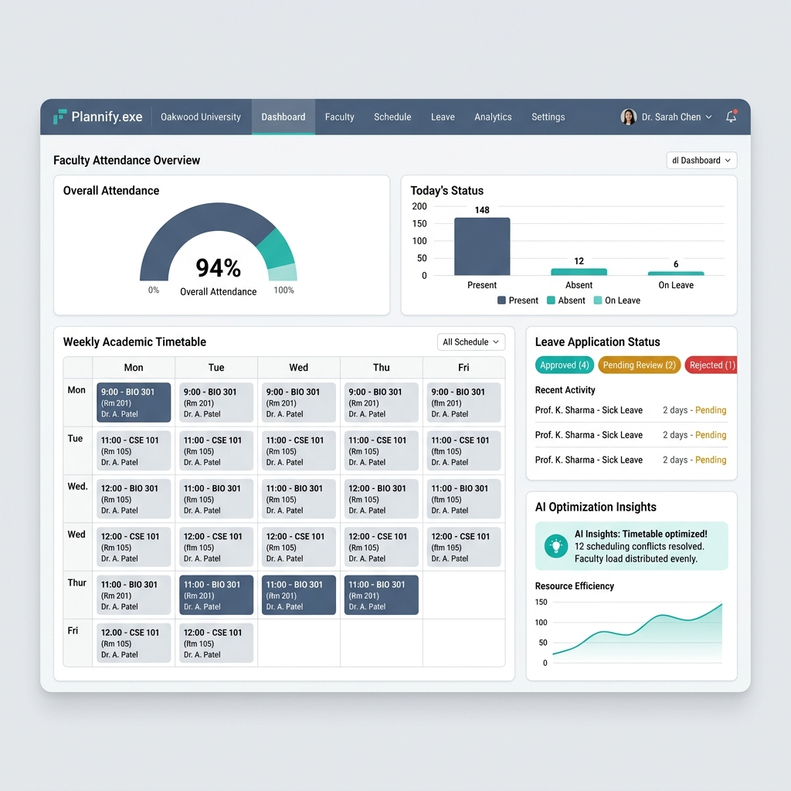

<div align="center">
  
  
  # 🎓 Plannify.exe | Academic Operations & Faculty OS
  
  **An enterprise-grade B2B platform combining mathematical timetable scheduling with complete Faculty Management.**  
  *Designed for university, college, and school ERP portals.*

  [](https://fastapi.tiangolo.com/)
  [](https://reactjs.org/)
  [](https://tailwindcss.com/)
  [](https://supabase.com/)
  [](https://developers.google.com/optimization)

</div>

---

## 🌟 Overview

**Plannify.exe** is a comprehensive **Smart Academic Operations Platform**. It solves institutional academic scheduling via **Google OR-Tools CP-SAT constraint solver** and provides a full-fledged **Faculty Management System (FMS)** for university admin portals.

> [!NOTE]
> Detailed technical specifications, database DDLs, and n8n integration blueprints are documented in [`PRD.md`](file:///c:/Users/vastu/OneDrive/Desktop/Projects/Plannify.exe/PRD.md).

---

## 🔥 Key System Capabilities

### 1. 🎓 Faculty Management System (FMS)
- **Central Directory**: Complete faculty profiles, employee IDs, designations, and department mappings.
- **Digital Leave Workflow**: Multi-level leave applications (CL, EL, ML, Comp-Off, OD) with auto-deduct balance tracking.
- **Biometric Attendance Integration**: Universal CSV & REST API parser for hardware punch machines (ZKTeco, eSSL, BioMax) with late-minutes calculation.
- **AI Substitution Engine**: Automatic substitute faculty suggestions based on timetable availability and workload balancing.

### 2. 🗓️ Smart Timetable Scheduler
- **Mathematical Constraint Engine**: Google OR-Tools CP-SAT model for conflict-free room, teacher, section, and slot allocation.
- **Lab-Block Aware**: Continuous 2-period lab block placement with dedicated room assignment.
- **"Genius" AI Failure Analysis**: Groq AI (Llama 3.3 70B) analyzes bottlenecks when schedules are mathematically constrained.
- **OCR Timetable Extraction**: Gemini 2.5 Flash OCR extracts structured data directly from uploaded timetable images.

### 3. ⚡ Cloud Sync & Automation
- **Supabase Cloud Sync**: Real-time relational database persistence for institutions.
- **n8n Webhook Integration**: Automated notifications (Email, WhatsApp) and personalized Excel timetable distribution.
- **Multi-Sheet Excel Export**: One-click professional exports for class sections and individual teacher schedules.

---

## 🛠️ Technology Stack

- **Frontend**: React 19, Tailwind CSS, Recharts, File-Saver, Axios
- **Backend**: FastAPI (Python 3.10+), Uvicorn, Pydantic v2
- **Optimization Engine**: Google OR-Tools (CP-SAT)
- **Database & Auth**: Supabase (PostgreSQL 15+, Row Level Security)
- **AI Engines**: Groq API (Llama-3.3-70B), Gemini 2.5 Flash
- **Automation**: n8n Webhooks

---

## 🚀 Quick Start Guide

### 1. Setup Environment Variables

Copy `.env.example` to root `.env` and `backend/.env`:

**Frontend `.env` (Root):**
```env
REACT_APP_API_URL=http://localhost:8080
REACT_APP_SUPABASE_URL=https://your-project.supabase.co
REACT_APP_SUPABASE_ANON_KEY=your_supabase_anon_key
```

**Backend `backend/.env`:**
```env
PORT=8080
CORS_ORIGINS=http://localhost:3000,http://127.0.0.1:3000
GROQ_API_KEY=your_groq_api_key
GEMINI_API_KEY=your_gemini_api_key
N8N_WEBHOOK_URL=your_n8n_webhook_url
SUPABASE_URL=https://your-project.supabase.co
SUPABASE_SERVICE_KEY=your_supabase_service_role_key
```

### 2. Database Initialization (Supabase)

Execute [supabase-faculty-migration.sql](file:///c:/Users/vastu/OneDrive/Desktop/Projects/Plannify.exe/supabase-faculty-migration.sql) in your Supabase **SQL Editor** to create all 13 core relational tables and RLS security policies.

### 3. Install & Run

**Backend (FastAPI):**
```bash
python -m uvicorn backend.main:app --host 0.0.0.0 --port 8080
```

**Frontend (React):**
```bash
npm install
npm start
```
*Open `http://localhost:3000` in your browser.*

---

## 📄 Documentation & Resources

- [Product Requirement Document (PRD)](file:///c:/Users/vastu/OneDrive/Desktop/Projects/Plannify.exe/PRD.md)
- [Supabase Migration SQL Script](file:///c:/Users/vastu/OneDrive/Desktop/Projects/Plannify.exe/supabase-faculty-migration.sql)
- [n8n Automation Guide](file:///c:/Users/vastu/OneDrive/Desktop/Projects/Plannify.exe/n8n_integration_guide.md)

---

## 📄 License

Distributed under the MIT License. See `LICENSE` for more information.

<div align="center">
  <p>Engineered with 💖 by the Plannify Engineering Team</p>
  <p><i>"Scheduling the future, one period at a time."</i></p>
</div>
